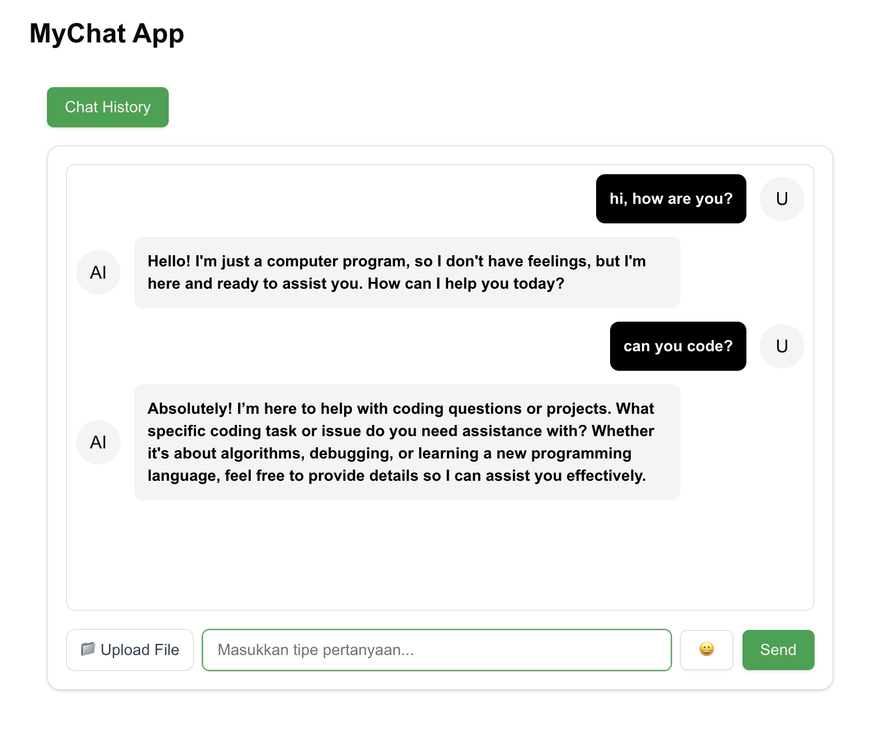

# Auto-Generate Prompt Chat App with Next.js 15, Supabase & ChatGPT-4o

This project is a **Next.js 15 App Router** application that provides an interactive chat system for automatically generating AI responses using **ChatGPT-4o**. The conversation history is stored in **Supabase** and displayed in a **chat interface** with **file uploads, emoji support, and auto-scroll features**.

---

## 🚀 Features

✅ **User Input Form**: Users can input messages and interact with AI in a real-time chat.
✅ **AI-Powered Responses**: The app calls ChatGPT-4o to generate intelligent responses based on user input.
✅ **Supabase Database Integration**: All chat history is stored in a PostgreSQL database.
✅ **File Uploads**: Users can send images/files along with their messages.
✅ **Emoji Picker**: Users can select emojis to enhance their messages.
✅ **Auto-Scroll to Latest Message**: Ensures that the latest messages are always visible.
✅ **Next.js 15 (App Router) Optimized**: Fully serverless and API-based chat system.

---



## 🛠️ Getting Started

### 1️⃣ Clone the repository

```bash
git clone https://github.com/ivandj0h/prompt-app.git
cd prompt-app
```

### 2️⃣ Install dependencies

```bash
npm install
```

### 3️⃣ Set up environment variables

Create a `.env.local` file in the root directory and add:

```bash
NEXT_PUBLIC_SUPABASE_URL=your_supabase_url
NEXT_PUBLIC_SUPABASE_ANON_KEY=your_supabase_anon_key
OPENAI_API_KEY=your_openai_api_key
```

### 4️⃣ Run the development server

```bash
npm run dev
```

Open [http://localhost:3000](http://localhost:3000) in your browser to see the app.

---

## 📦 API Endpoints

### 🔹 Send a Message

**Endpoint:** `POST /api/chat`

- **Request Body:** `{ "message": "Your message here" }`
- **Response:** `{ "id": "uuid", "sender": "user", "message": "Your message", "response": "AI Response" }`

### 🔹 Fetch Chat History

**Endpoint:** `GET /api/chat-history`

- **Response:** `[{ "id": "uuid", "sender": "user", "message": "User message", "response": "AI Response" }]`

---

## 🗄️ Database Schema (Supabase)

```sql
CREATE TABLE chat_messages (
  id UUID PRIMARY KEY DEFAULT gen_random_uuid(),
  sender TEXT NOT NULL,
  message TEXT NOT NULL,
  response TEXT,
  file TEXT,
  created_at TIMESTAMP DEFAULT now()
);
```

---

## 🎨 Tech Stack

- **Next.js 15 (App Router)** - Server Components & API Routes
- **Supabase** - PostgreSQL as a Database
- **ChatGPT-4o** - AI-generated responses
- **Tailwind CSS** - Styling
- **ShadCN UI** - Custom UI Components
- **React Code Blocks** - Pretty-print AI-generated code responses

---

## 🚀 Deploying to Vercel

To deploy this project on **Vercel**, run:

```bash
npx vercel
```

Follow the instructions to complete the deployment. Your app will be live at `https://your-vercel-app.vercel.app/`.

---

## 🎯 Future Improvements

✅ Implement WebSockets for real-time chat updates.
✅ Allow users to download chat history.
✅ Improve UI with better animations and themes.

Feel free to contribute and improve this project! 🔥
